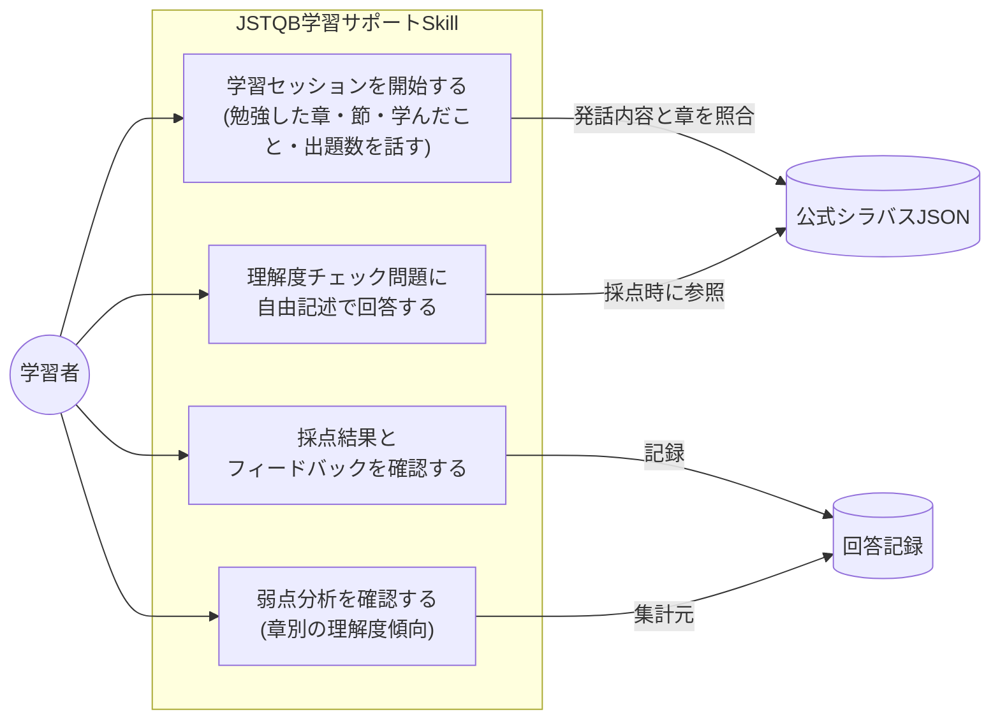
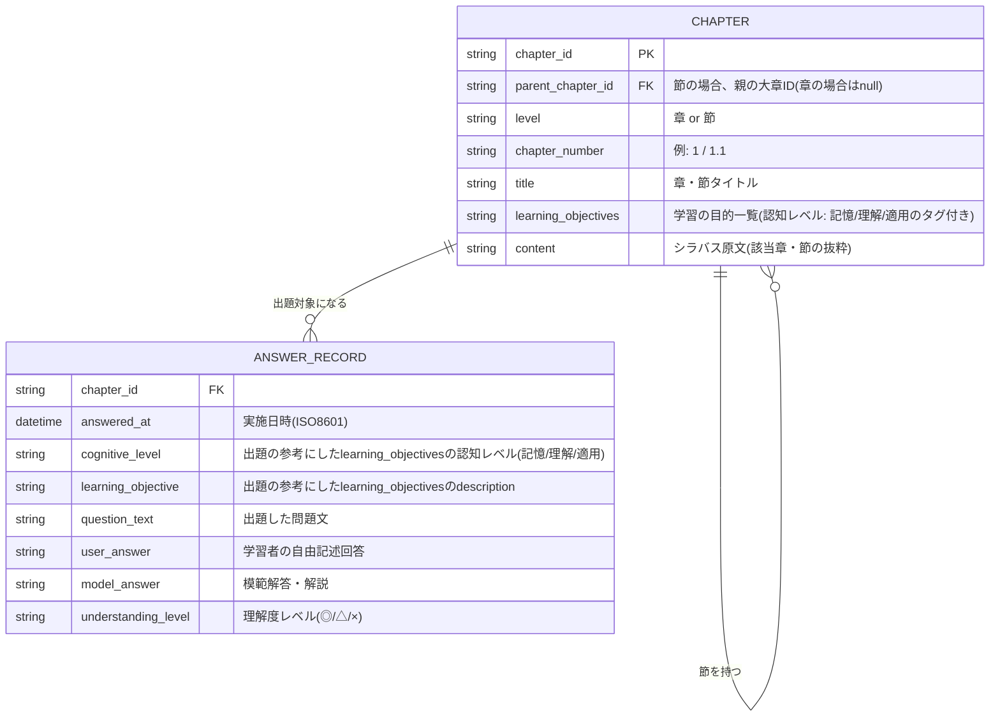
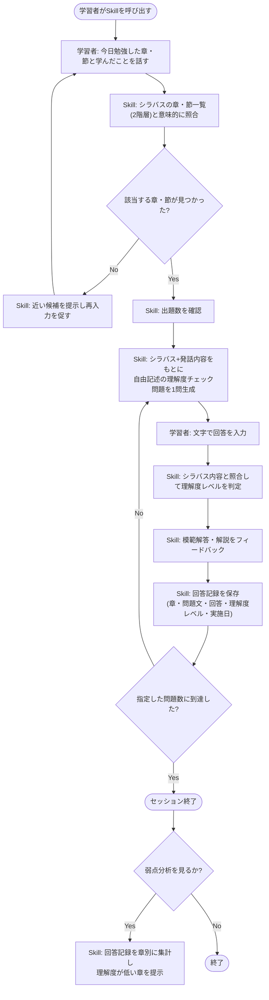

# JSTQB学習サポートSkill 設計書

関連issue:
- [#15 JSTQB学習サポートSkillの作成(ブレスト)](https://github.com/yuyakawai0411/issues/issues/15)(親: [#8](https://github.com/yuyakawai0411/issues/issues/8))
- [#11 JSTQ合格者の成功体験を知り、資格試験サポートアプリの方針を決める](https://github.com/yuyakawai0411/issues/issues/11)(学習方針の結論)

## 概要

JSTQB Foundation Level(FL)の学習を、Claude Skillとして支援する。
issue #11の調査結果より、4択の反復演習・復習は既存アプリ「テス友」で十分にカバーされていることが分かったため、本Skillは**そこでは満たせない課題に特化**する。

## 本Skillが解決する課題

- 従来の練習問題では、自分が学習を終えた章までの範囲に絞って練習問題を出すのが難しかった
- 従来の練習問題は選択式問題になるため、勘で正答できてしまい、なぜその回答になったのか(理解度)をチェックする仕組みがなかった

## 学習方針

- **Input教材**
  - 理解度チェック用(解説の拠り所): 公式シラバス(PDF)
  - 練習問題用(4択の反復演習): テス友アプリ
- **本Skillの役割**: 学習した章の内容について、**自由記述(文字入力)の理解度チェック問題のみ**を生成・採点する
  - 4択の本番形式問題や単純な反復演習はテス友でカバーするため、本Skillでは扱わない
- **勉強スケジュール**: 1ヶ月前後、平日1h・休日2〜4h

## 提供する機能

1. 学習した章・出題数を指定した、自由記述の理解度チェック問題の出題
2. 回答の採点(理解度レベル: ◎/△/×)とフィードバック(模範解答・解説)
3. 回答履歴の記録(問題・回答・理解度レベル・実施日・対応章)

## ユーザーストーリー(詳細)

### 対話駆動の理解度チェック

1. 学習者がSkillを呼び出し、「今日勉強した章」と「学んだこと(内容の要点)」を対話的に話す
2. Skillはシラバスの**章・節一覧**(2階層)と発話内容を**意味的に**照合し、該当する章・節を特定する
   - 表記ゆれ(例:「テスト基礎」⇔「第1章 ソフトウェアテストの基礎」)は許容し、柔軟に判断する
   - 複数章・節にまたがる発話であれば、複数を対象にする
   - 節までの粒度に対応するため、「1章のうち1.1だけ勉強した」のような部分的な発話も特定できる
   - 該当する章・節が特定できない場合は、**近い候補を提示して再入力を促す**(セッションを打ち切らず、対話を継続する)
3. Skillは出題数を学習者に確認する(件数は引き続き学習者が指定する)
4. Skillは「シラバスの該当章の内容」と「学習者が話した学んだことの内容」の**両方**を踏まえて、自由記述の理解度チェック問題を1問ずつ生成する
   - 学習者の発話内容も出題の材料にすることで、学習者が実際に説明していた理解の切り口を突く問題を作れるようにする
5. 学習者が文字で回答 → Skillがシラバス内容と照合して理解度レベル(◎/△/×)を判定 → 模範解答・解説をフィードバック
6. 回答記録を保存(章・問題文・回答・理解度レベル・実施日)
7. 指定した問題数に達したらセッション終了

## 注意事項

- **「理解度が浅い問題を復習として再出題する」機能(復習モード)は、本Skillのスコープからは除外する**。対話フローが複雑になりすぎるため、別のSkillとして切り出して設計する
  - 本Skillは「回答記録の保存」「章別の弱点分析(理解度傾向の可視化)」までを担当し、その記録を使って実際に復習問題を出題する部分は別Skillの責務とする

## ユースケース図



- アクターは「学習者」のみ(Claude Skill自体は学習者の指示に応じて動く受動的な存在のため、別アクターとしては表現しない)
- 「公式シラバスJSON」「回答記録」はユースケースが参照・更新するデータストアとして図示
- 「理解度が低い問題を復習として再出題する」ユースケースは対象外(注意事項を参照。別Skillで扱う)

## ER図



- `CHAPTER` は公式シラバスを章立てJSON化したマスタデータ(セットアップ時に用意し、以後は参照のみ)。粒度は**「章」(1〜6)と「節」(1.1、1.2…)の2階層**まで含める(「項」1.1.1レベルは含めない)
  - 学習者が発話した内容は、章単位・節単位のどちらでも照合できるようにするため、`CHAPTER`は自己参照(`parent_chapter_id`)で階層を表現する
- `content`にはシラバス原文(該当章・節の抜粋)をそのまま格納する。private運用を前提とするため要約への言い換えは行わない(詳細は「教材データの取り扱い方針」を参照)
- `keywords`(章冒頭のキーワード一覧)は当初検討したが不採用とした。元データが章単位でしか存在せず節の絞り込みに使えない上、シラバス全体で頻出する一般語ばかりで照合の役に立たないことが試作で判明したため
- `learning_objectives`は`content`と並ぶ出題の材料として使う。節ごとに複数の目的(認知レベル: 記憶/理解/適用)を持ち、Skillは認知レベルに応じて問い方を変える(記憶→想起系、理解→比較・理由説明系、適用→応用・シナリオ系)。詳細はSkill側(`jstqb-study`)の実装を参照
  - シラバス上のFL-x.x.x識別子は、章立てJSON作成時に節へ紐付けるためだけに使い、`learning_objectives`自体には持たせない。節単位で学習・出題する設計のため、節内でのさらに細かい区分は不要と判断した
- 問題自体はその場で動的生成し使い捨てるため、独立した `QUESTION` テーブルは持たず、生成した問題文と模範解答を `ANSWER_RECORD` にそのまま保存する
- `cognitive_level`・`learning_objective`は、出題時に参考にした`CHAPTER.learning_objectives`の該当項目をそのまま複製して記録する。これにより、章・節単位だけでなく**認知レベル単位(記憶/理解/適用のどれが苦手か)でも弱点分析ができる**ようになる
- `ANSWER_RECORD` が「回答履歴」「弱点分析(章・理解度レベル・認知レベルでの集計)」の両方の元データになる
- `id`は持たない。`ANSWER_RECORD`を参照する他のエンティティが無く(FKで指されない)、`answered_at`を日付だけでなく時刻まで含むISO8601形式にすることで、一意性・並び替えの両方を兼ねられるため(`learning_objectives.id`を廃止したのと同じ考え方)
- 復習モード用の`mode`列は今回のスコープでは不要(注意事項を参照)。復習Skill側でこの`ANSWER_RECORD`を参照する形になった場合は、その設計時にあらためて検討する

### 記録ファイルの構成

- **形式: JSONL(1行1レコード)**。JSON配列だと追記のたびにファイル全体を読み込んで書き直す必要があり、件数が増えるとGit diffのノイズも増えるため、末尾に1行足すだけで済むJSONLを採用する
- **単一ファイル(`records/answers.jsonl`)**。個人利用・低頻度(1日数問程度)の想定では、試験対策期間全体でも記録は多くて数百件程度に収まる見込みで、章別・月別に分割するメリットがコストに見合わない

```json
{"chapter_id": "1.2", "answered_at": "2026-08-09T14:32:00+09:00", "cognitive_level": "理解", "learning_objective": "テストと品質保証の関係を想起する。", "question_text": "...", "user_answer": "...", "model_answer": "...", "understanding_level": "△"}
```

## 教材データの取り扱い方針(著作権への配慮)

公式シラバスは「無断転載を禁じる」「ISTQB®の書面承認なく他の方法で使用することを禁止」と明記された著作物のため、以下の方針で扱う。

- **Skillを配置するリポジトリ・学習記録リポジトリは共にprivateで運用する**。これを前提に、`CHAPTER.content`にはシラバス原文の抜粋をそのまま格納してよいこととする(要約への言い換えは行わない)
  - private運用が崩れない限り公開範囲の問題は起きない認識のため、精度を優先して原文をそのまま採用する
- **NotebookLM Enterprise API連携は検討したが見送り**: NotebookLMのAPIは個人向けプラン(無料/Plus)には提供されておらず、Google Cloud基盤の**Enterprise版限定**([出典](https://www.communeify.com/ja/blog/notebooklm-enterprise-api-programmatic-notes-workflow/))。個人利用でSkillから自動連携する用途には使えないため不採用とし、原文JSON+Claude Skillという現行方針を継続する

## コンテンツ取得方式の検討(PDFのまま扱う vs pdftotextでパース)

問題生成・採点の精度を上げる観点で、`CHAPTER.content`の元データをPDFのまま扱うか、`pdftotext`でテキスト抽出したものを使うかを比較検討した。**`pdftotext`でパースしたテキストを採用する。**

**PDFのまま扱う場合**
- ClaudeのReadツールでPDFを開くと、ページを画像としてレンダリングして読む形になる(`poppler`導入により技術的には可能)
- メリット: デシジョンテーブル・状態遷移図・テストピラミッドのような**図表そのものを視覚的に読める**
- デメリット:
  - 章・節ごとに「どのページ範囲か」の事前マッピングが結局必要で、テキスト抽出時の前処理と同程度の手間がかかる
  - 画像のため`grep`や正規表現による機械的な章・節分割/検索ができず、JSONの`content`にどう構造化して格納するかが曖昧になる
  - 出題・採点のたびに複数ページを画像として読み込むことになり、コンテキスト消費が大きい

**pdftotextでパースしたテキストの場合**
- メリット: 見出し番号(`^\d(\.\d)*\s`)による機械的な章・節分割、`content`への構造化格納、検索がしやすい。実際に公式シラバスPDFを確認したところ、本文の大部分(説明文・箇条書き)はテキストのみで意味が十分取れる
- デメリット: 図表に強く依存するセクションだけ情報が薄くなる

**判断根拠(検討時点)**
`pdftotext`でのテキスト確認の時点では、図表に強く依存していそうなセクションとして 4.2.3(デシジョンテーブルテスト)・4.2.4(状態遷移テスト)・5.1.6(テストピラミッド)・5.1.7(テストの四象限)を想定していた。そのため、**基本方針は`pdftotext`でのテキスト抽出とし、図表に依存するセクションのみ手動でテキスト補足するハイブリッド運用**を検討していた。

**再検証の結果: 図表依存の懸念は今回は該当しなかった**
実際に`poppler`でPDFページを画像としてレンダリングし、4.2.3・4.2.4・5.1.6・5.1.7の該当ページ(p.41〜43, p.51〜53)を目視確認した。その結果、**いずれのセクションも図・イラストは一切埋め込まれておらず、完全に文章のみで説明が完結**していた(`pdftotext`の抽出結果と画像の内容が完全に一致)。一般的なISTQB教材のイメージ(デシジョンテーブルや状態遷移図は図解されるはず)から図表依存を想定していたが、この公式シラバス(V4.0)自体にはその想定は当てはまらなかった。

**結論**: 少なくとも今回確認した4セクションについては**手動でのテキスト補足は不要**。`pdftotext`によるテキスト抽出のみで`content`を構成する。他の章・節を章立てJSON化する際に、実際に図が埋め込まれているセクションを見つけた場合は、その時点で個別に「Claudeが画像を見て自分の言葉で説明し直す」方式(当初検討していた案A+C)を適用する。

## フローチャート



## 検討した実装アプローチ

**案A: 単一Skill + JSONデータストアのみ**
- 1つのClaude Skillに「出題」「採点」「記録」「弱点分析」の全ロジックを自然言語指示として記述
- データは全て素のJSON/CSVファイルで、SkillがRead/Write/Editツールで直接読み書き
- メリット: 追加依存ゼロ、セットアップが最速
- デメリット: データ量が増えると集計の精度・速度がやや不安定になる可能性

**案B: Skill + 補助スクリプト(Python/Node)**
- 出題・対話はSkillが担当、記録の集計・弱点抽出は決定的なスクリプトが担当
- メリット: 集計ロジックが正確・高速、テストも書ける
- デメリット: 初期構築コストが増える。個人利用のスモールスタートには過剰な可能性

**案C(採用): 案Aをベースに、教材変換だけ専用の一段階に分離**
- 案Aと同じだが、「公式シラバスPDF→章立てJSON」の変換を独立したセットアップ手順として明確に切り出す
- 変換ロジックが複雑になりがちなので、混ぜずに切り分けることで見通しを良くする

## 今回目標とする資格

**JSTQB Foundation Level(FL)**

- 40問選択式、制限時間60分、65%以上(26問以上)で合格
- 現行シラバスはVersion 4.0(テストの基礎/SDLC全体のテスト/静的テスト/テスト分析・設計/マネジメント/ツールの6章構成)
- 社内の兼田氏([記事](https://tech.itandi.co.jp/entry/2026/08/06/173704))が受験・合格した科目と同じものを受験する
  - 兼田氏が明示していた参考資料はJSTQB公式シラバス(Version 4.0)のみで、具体的な勉強法・学習スケジュール・使用教材の記述はなかった

## 取得する教材

- **公式シラバス・用語集**(無料, [jstqb.jp/syllabus.html](https://jstqb.jp/syllabus.html)) — 本Skillの出題元(章立てJSON化の元データ)であり、理解度チェック時の解説の拠り所
- **テス友(アプリ, 無料)** — 4択の本番形式演習と復習機能を担当。本Skillとは役割を分担する
- 「ソフトウェアテスト教科書 JSTQB Foundation 第5版」「徹底攻略 JSTQB Foundation教科書＆問題集」は必要に応じて補助教材として検討(購入は未確定)

## 未確定事項(次のステップで詰める)

- [x] Skillを配置する新規リポジトリ名・置き場所 → [study-jstqb](https://github.com/yuyakawai0411/study-jstqb)(private)を作成し、`.claude/skills/jstqb-study/SKILL.md`にSkillの雛形を配置済み
- [x] 公式シラバスPDF→章立てJSONの変換 → 全6章・22節分を`study-jstqb`の`syllabus/chapters.json`として整備済み。図表依存セクション(4.2.3・4.2.4・5.1.6・5.1.7)は図表なしと確認済みのため手動補足は不要だった
- [x] Skill起動時のコマンド/呼び出し方 → 自然言語のトリガーフレーズで判定する方式に決定(スラッシュコマンドではない)。「学習セッション開始」「弱点分析」の2意図をfrontmatterのdescriptionと本文で明示し、判断がつかない場合は学習者に確認する。詳細は`study-jstqb`の`SKILL.md`「呼び出し方(トリガー)」を参照
- [x] 理解度レベル(◎/△/×)の判定基準の詳細 → シラバス付録A(記憶/理解/適用の公式定義、出典: Anderson & Krathwohl 2001の改訂版ブルーム・タキソノミー)に沿って、cognitive_level別の判定基準表を`study-jstqb`の`SKILL.md`に定義。横断ルールとして「原文と矛盾する記述があれば×」を追加
- [x] 学習記録を保存するファイル構成 → `study-jstqb`リポジトリの`records/answers.jsonl`に、JSONL・単一ファイル形式で保存する方針に決定(詳細は「記録ファイルの構成」を参照)
- [x] モバイル(Claudeアプリ)からの利用時、教材データベース(シラバスJSON)や学習記録ファイルにどうアクセスするか → `study-jstqb`リポジトリに動作確認用Skill(sample-check)を配置し、Claude Codeモバイルアプリからリポジトリを開いて実際に呼び出せることを確認済み。`.claude/skills/`はモバイルからも通常のCLIと同様に検出される
- [x] 採点時にどの範囲のシラバスJSONを読み込むか → ファイル分割はせず単一の`chapters.json`のまま、`jq`で章・節一覧や該当レコードだけを部分抽出する方式に決定(全体で約180KBあり、`Read`での全文読み込みは避ける)
